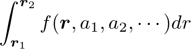
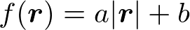

# 安藤研究室用ライブラリ
## 目次
* [概要](#概要)
* [Vector3d.h 3次元ベクトルのクラス](#vector3dh-3次元ベクトル)
* [Matrix3d.h 3×3行列のクラス](#matrix3dh-33行列)
* [関数gauss_quadrature ガウス・ルジャンドル積分](#関数gauss_quadrature)
* [関数vector_gauss_quadrature 位置ベクトルを引数とするガウス・ルジャンドル積分](#関数vector_gauss_quadrature)
* [関数allocate_memory*n*d *n*次元配列の確保](#関数allocate_memorynd)

## 概要
* 全て namespace は <b>AndoLab</b>

## Vector3d.h: 3次元ベクトル

### インクルード
```C++:Vector3d.h
#include <Vector3d.h>
```

### 定数
```C++:
enum class Andolab::coordinate { Cartesian, Spherical };
```

### コンストラクタ
Tは任意の型
```C++:
Vector3d <T> v;
Vector3d <T> v(T x, T y, T z); /* デカルト座標系でのベクトル(x,y,z)  */
Vector3d <T> v(T x1, T x2, T x3, AndoLab::coordinate cs); /* 座標系csで指定されたベクトル(x1,x2,x3) */
```

### アクセサ
```C++:
T x(void); /* デカルト座標系のx座標 */
T y(void); /* デカルト座標系のy座標 */
T z(void); /* デカルト座標系のz座標 */
T r(void); /* 球座標系のr座標(θ、φ方向) */
T theta(void); /* 球座標系のθ座標 */
T phi(void); /* 球座標系のφ座標 */

void set(T x, T y, T z); /* デカルト座標系でのベクトル(x,y,z)  */
void set(T x1, T x2, T x3, AndoLab::coordinate cs); /* 座標系csで指定されたベクトル(x1,x2,x3) */
```

### 演算子
`a, b`は `Vector3d <T>`とする。pは`T`型の変数・定数とする。
* `a + b` : 和
* `a - b` : 差
* `p * a`, `a * p` : スカラー倍
* `a / p` : スカラー割
* `a * b` : 外積、ベクトル積
* `a % b` : 内積、スカラー積
* `a & b` : 成分毎の掛け算
* `a / b` : 成分ごとの割り算

### メンバ関数
* `T abs(void)` : 大きさ
* `Vector3d <T> n(void)` : 正規化、単位ベクトル化
* `Vector3d <T> rotate(T θ, Vector3d <T> n)` : ベクトルn を軸に角度θ回転する
* `std::string string(std::string separator, std::string kakko)` : 表示用のstring型作成。separator(kakkoが省略なら省略可)は,(カンマ)などを指定する(省略時は空白一文字)。kakko(省略可)は ```()``` といった、3成分を囲むカッコの組を与える(省略時は囲みなし)。
* `Vector3d <T> r_vector(void)` : そのオブジェクトの座標における r方向単位ベクトル 𝒓^
* `Vector3d <T> theta_vector(void)` : そのオブジェクトの座標における θ方向単位ベクトル 𝜽^
* `Vector3d <T> phi_vector(void)` : そのオブジェクトの座標における φ方向単位ベクトル 𝝓^
* `T latitude(void)` : そのベクトルの方向の緯度 [deg]、南緯は負
* `T longitude(void)` : そのベクトルの方向の経度 [deg]、西経は負

### 非メンバ関数
* `T abs(Vector3d <T> a)` : ベクトルaの大きさ
* `T angle_between(Vector3d <T> a, Vector3d <T> b)` : ベクトルa, bのなす角 [rad]
* `T geographic_coordinate(T Latitude, T Longitude)` :
Latitude [deg], Longitude [deg] で表される地理座標の方向を向く単位ベクトル。南緯は負で表す。西経は負、または180°以上を用いる。
経度0°が +x方向となる。

## Matrix3d.h 3×3行列

### 概要
3×3に限った行列のクラス。まだ実装中

### インクルード
```C++:Matrix3d.h
#include <Matrix3d.h>
```
### コンストラクタ
Tは任意の型
```C++:
Matrix3d <T> A; /* 全ての要素が 0 の行列 */
Matrix3d <T> A(T** v); /* 2次元配列のポインタを渡す */
Matrix3d <T> A(T* v); /* 1次元配列のポインタを渡す。行優先。 e00, e01, e02, e10, e11, .. という並び */
Matrix3d <T> A(T v00, v01, v02, v10, v11, v12, v20, v21, v22); /* 全ての要素の数を渡す */
```

### アクセサ
```C++:
T e(int m, int n); /* m行n列の値を返す (0 ≦ m, n ≦ 2) */
```

### 演算子
`A, B` は `Matrix3d <T>`、`x, b` は `Vector3d <T>`型とする。
* `A * B` : 行列の積
* `A * x` : 行列とベクトルの積

### 非メンバ関数
* `Matrix3d <T> rotation_matrix(T θ, Vector3d <T> n)` : ベクトル`n` を軸に角度θ回転する行列 (ベクトルにかける)

## 関数gauss_quadrature

### 概要
よくあるGauss Legendre積分

### インクルード
```C++:gauss_quadrature.h
#include <gauss_quadrature.h>
```

### 使用法

被積分関数は、積分変数が double型、それ以外のパラメタは
クラスなどにして、そのアドレスを void*型にキャストして渡す

`double AndoLab::gauss_quadrature( double(*)(double, void*), void* parameters, double a, double b)`

* `a, b`: 積分区間 [a, b]

### 例

```C++:sample.cpp
class parameters{
private:
public:
  double a, b;
};

double function(double x, void *p){
  parameters p1 = *( (parameters*)p );
  return (p1.a * x + p1.b);
}

int main(void){

  parameters p;
  p.a = 5.0;
  p.b = 3.0;

  double ans = AndoLab::gauss_quadrature(function, (void*)(&p), 0.0, 1.0);
```

## 関数vector_gauss_quadrature

### 概要
位置ベクトルｒを変数に持つスカラ関数f(ｒ, a1, a2, ...)を、位置ｒ1からｒ2までの直線距離を経路として



を計算する。

### 使用法
1. 被積分関数として
`double function(Vector3d <double>, void*)`
で定義される関数を準備する。void*の引数は、別の型、構造体、クラスのポインタにキャストし直すことで、積分変数以外の任意のパラメタを加えることが出来る。
2. 積分範囲を定義して呼び出す。
```C++:
double result = vector_gauss_quadrature(r1, r2, function, (void*)pointer_of_parameters)
```

### 使用例
の計算
```C++:
class params{
public:
  double a, b;
};

double func1(AndoLab::Vector3d <double> r, void* vp){
  params p = *( (params*)vp );

  return p.a * AndoLab::abs(r) + p.b;
}

int main(void){
  params p0;
  p0.a = 3.0;
  p0.b = 2.0;

  Vector3d <double> r1(0.0, 0.0, 0.0);
  Vector3d <double> r2(1.0, 2.0, 3.0);
  double v = vector_gauss_quadrature(r1, r2, func, (void*)&p0);
}
```

## 関数allocate_memory*n*d

*n*次元配列を確保し、ポインタを返す。
*n*は2〜4のみ。初期値の型によって確保される型が異なる。

### インクルード
```C++:memory_allocate.h
#include <memory_allocate.h>
```

### 使用法
```C++:
double **ptr = allocate_memory2d(m, n, 0.0); /* m×nを確保し、0.0を代入する */
deallocate_memory(ptr); /* 開放 */
```

### 注意点
* 初期値の変数の型によって確保される型が異なる。紛らわしい場合は明示的にキャストする。
* 連続した領域を確保しているため、例えば、上のptrにおいて、`ptr[i][j]` と `ptr[0][i*n+j]`は同じ

## physical_constants.h 物理定数

### インクルード
```C++:physical_constants.h
#include <physical_constants.h>
```

### 定義されている定数
* `double C0` = 299792458 m/s (真空中の光速)
* `double MU0` = 4π×10^{-7} H/m (真空の透磁率)
* `double EPS0` = 1/C0^2/MU0 ≒ 8.854 × 10^{-12} F/m (真空の誘電率)
* `double MOLAR_GAS_CONSTANT` = 8.3144598 J/K/mol (モル気体定数R)
* `double BOLTZMANN_CONSTANT` = 1.38064852 × 10^{-23} m^2 kg/s^2/K (ボルツマン定数 k_B)
